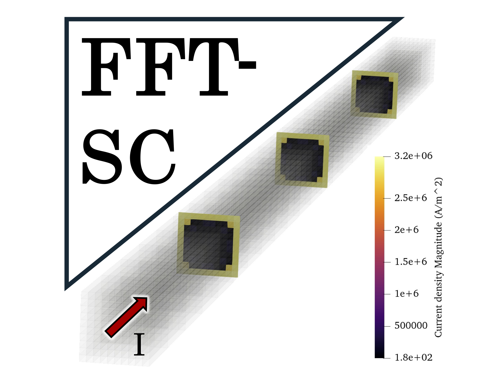

	

# FFT-SC 

This directory contains a FFT-SC code for superconducting structures

This code has been inspired by VoxHenry https://github.com/acyucel/VoxHenry

-------------------------------------------------------------------

# Description
 
FFT_SC.m is the main file you must run to start the code. 

All user-settable quantities, e.g. injected current, frequency, are contained in the block identified by the 
BEGIN USER SETTINGS / END USER SETTINGS comments.

Available test cases
--------------------
Some simple test cases are contained in separate directories under "data". 
Set the "name_dir" variable in "FFT_SC.m"  to the appropriate directory.

User-defined test cases
-----------------------
Follow the instuctions given in "README.txt" inside the "data" directory.

Results visualization
--------------------
The plot of the power losses is given at the end of the simulation.

Credits
--------------------
If you use FFT-SC, please consider citing:

 [1] [F- Lucchini et al., "A Fast Integral Equation $J-\varphi$ Formulation for Superconducting Structures," in IEEE Transactions on Applied Superconductivity, vol. 34, no. 4, pp. 1-8, Jun. 2024, doi: 10.1109/TASC.2024.3366189](https://ieeexplore.ieee.org/document/10437996)
 
 [2] [R. Torchio et al., "FFT-PEEC: A Fast Tool From CAD to Power Electronics Simulations," in IEEE Transactions on Power Electronics, doi: 10.1109/TPEL.2021.3092431](https://ieeexplore.ieee.org/document/9465649)

 [3] [P. Bettini et al., "Fast Fourier transform-volume integral: a smart approach for the electromagnetic design of complex systems in large fusion devices", Plasma Physics and Controlled Fusion, Volume 63, Number 2, doi: 10.1088/1361-6587/abce8f](https://iopscience.iop.org/article/10.1088/1361-6587/abce8f)
 
and FFT-SC itself

 [4] F. Lucchini, R. Torchio, "FFT-SC toolbox", https://github.com/UniPD-DII-ETCOMP/FFT-SC

Contacts & Authors
-----------------------
For any questions or need help to solve your problem, please contact us

Francesco Lucchini (francesco.lucchini@unipd.it)

Riccardo Torchio (riccardo.torchio@unipd.it)
